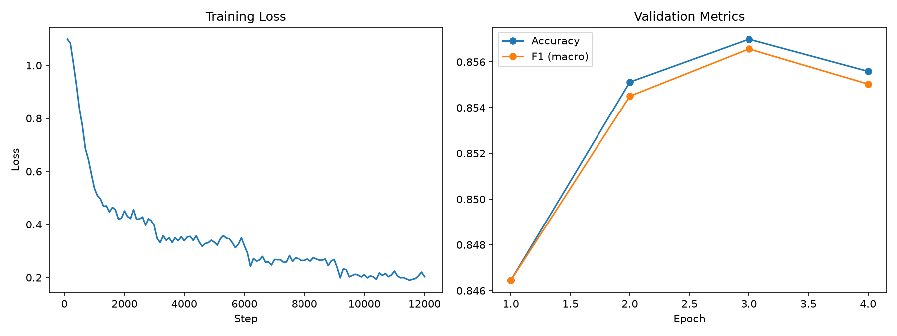
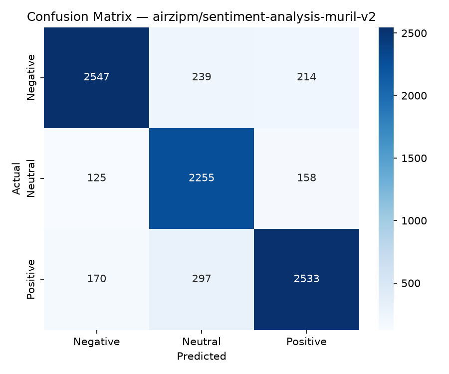

<div align="center">

# 🎭 AI Sentiment Analysis (v1 & v2)
### Fine-tuned RoBERTa (English) & MuRIL (Multilingual) · 3-Class Sentiment

[](https://huggingface.co/airzipm/sentiment-analysis-muril-v2)
[](https://huggingface.co/airzipm/sentiment-analysis-roberta)
[](https://huggingface.co/datasets/airzipm/sentiment-dataset-en-hi-hinglish-v2)
[](https://huggingface.co/datasets/airzipm/sentiment-dataset)
[](https://python.org)
[](https://pytorch.org)
[](https://huggingface.co/docs/transformers)

<br/>

> A production-grade sentiment analysis ecosystem featuring two models:
> **v1 (RoBERTa)** for high-speed English text, and **v2 (MuRIL)** for robust handling of English, Hindi (Devanagari), and Hinglish (code-mixed).

<br/>



</div>

---

## 📌 Table of Contents

- [Live Demo & Usage](#-live-demo--usage)
- [Models Overview](#-models-overview)
- [v2 Model Details (MuRIL)](#-v2-model-details-muril)
- [v1 Model Details (RoBERTa)](#-v1-model-details-roberta)
- [Project Architecture](#-project-architecture)
- [Preprocessing Pipeline](#-preprocessing-pipeline)
- [Project Structure](#-project-structure)
- [Tech Stack](#-tech-stack)
- [Author](#-author)

---

## 🚀 Live Demo & Usage

You can use either model instantly via the Hugging Face pipeline:

```python
from transformers import pipeline

# Load v2 (MuRIL) for Multilingual (English + Hindi + Hinglish)
clf_v2 = pipeline("text-classification", model="airzipm/sentiment-analysis-muril-v2")

print(clf_v2("ye movie achi hai"))
# [{'label': 'Positive', 'score': 0.95...}]

print(clf_v2("यह फिल्म बहुत अच्छी है"))
# [{'label': 'Positive', 'score': 0.98...}]

print(clf_v2("movie thik thak tha, kuch khaas nahi"))
# [{'label': 'Neutral', 'score': 0.81...}]

# Load v1 (RoBERTa) for pure English
clf_v1 = pipeline("text-classification", model="airzipm/sentiment-analysis-roberta")

print(clf_v1("Best product I've ever bought — absolutely love it!"))
# [{'label': 'Positive', 'score': 0.973...}]
```

---

## 🧠 Models Overview

This project includes two state-of-the-art fine-tuned models tailored for different use cases.

| Feature | v2 (MuRIL) | v1 (RoBERTa) |
|---|---|---|
| **Base Model** | `google/muril-base-cased` | `roberta-base` |
| **Languages** | English, Hindi, Hinglish | English |
| **Classes** | Negative, Neutral, Positive | Negative, Neutral, Positive |
| **Training Data** | ~100K+ Multilingual | ~200K+ English |
| **Best For** | Social media, code-mixed text, South Asian demographics | Fast inference on pure English corpora |

---

## 🇮🇳 v2 Model Details (MuRIL)

A 3-class sentiment classifier fine-tuned from [`google/muril-base-cased`](https://huggingface.co/google/muril-base-cased), which natively handles **Hindi (Devanagari)** and **Hinglish (romanized code-mixed Hindi-English)** text in addition to English.

### Training Data
- **English:** IMDB, SST-2 (GLUE), Yelp Polarity, Tweet Eval
- **Hindi / Hinglish:** ai4bharat/IndicSentiment, Hindi-English code-mixed tweet datasets

*Classes were capped per-label and a class-weighted loss was used during training to reduce the effect of English data outnumbering Hindi/Hinglish data.*

### Test Set Results

| Label | Precision | Recall | F1-Score | Support |
|---|---|---|---|---|
| **Negative** | 0.90 | 0.85 | 0.87 | 3000 |
| **Neutral** | 0.81 | 0.89 | 0.85 | 2538 |
| **Positive** | 0.87 | 0.84 | 0.86 | 3000 |
| **Accuracy** | | | **0.86** | 8538 |



### Limitations
- Hindi/Hinglish training data is smaller than English data — expect somewhat lower accuracy on these languages compared to pure English.
- Code-mixed spelling varies informally (e.g., "acha"/"accha"/"achha") — coverage depends on training tweet distributions.
- Not evaluated on domains far from reviews/social media (e.g., formal news, legal text).

---

## 🇺🇸 v1 Model Details (RoBERTa)

Our original production-grade model fine-tuned on **roberta-base** using advanced deep learning techniques for extremely accurate English sentiment analysis.

### Training Data
Four public datasets combined into a unified 3-class corpus (200,000 samples total):
- [IMDB](https://huggingface.co/datasets/imdb) (Movie reviews)
- [SST-2](https://huggingface.co/datasets/glue) (Short sentences)
- [Tweet Eval](https://huggingface.co/datasets/tweet_eval) (Twitter posts)
- [Yelp Review Full](https://huggingface.co/datasets/yelp_review_full) (Business reviews)

### Training Configuration
- **Optimizer:** AdamW with layer-wise weight decay
- **Scheduler:** Linear warmup + decay
- **Precision:** FP16 mixed precision training via `torch.cuda.amp`
- **Techniques:** Gradient clipping, label smoothing (0.1), and early stopping.

---

## 🏗️ Project Architecture

```
Raw Text (from multiple datasets)
        │
        ▼
┌─────────────────────┐
│  Text Cleaning      │  12-step pipeline
│  Pipeline           │  Contractions · Emojis · Lemmatize
└─────────┬───────────┘
          │
          ▼
┌─────────────────────┐
│  Tokenization       │  BPE / WordPiece · max_length=128
│                     │  Padding · Truncation
└─────────┬───────────┘
          │
          ├───────────────────────────────┐
          ▼                               ▼
┌─────────────────────┐         ┌─────────────────────┐
│    roberta-base     │         │   muril-base-cased  │
│    (v1: English)    │         │ (v2: Multilingual)  │
└─────────┬───────────┘         └─────────┬───────────┘
          │                               │
          ▼                               ▼
┌─────────────────────┐         ┌─────────────────────┐
│  API Backend        │         │  API Backend        │
│  (FastAPI + HF Space)         │  (FastAPI + HF Space)
└─────────┬───────────┘         └─────────┬───────────┘
          │                               │
          └───────────────┬───────────────┘
                          ▼
                ┌─────────────────────┐
                │  Unified Frontend   │
                │  (HTML/JS UI)       │
                └─────────────────────┘
```

---

## 🧹 Preprocessing Pipeline

A 12-step cleaning pipeline applied to all splits before tokenization:

```python
def clean_text(text):
    text = contractions.fix(text)                    # 1. don't → do not
    text = emoji.demojize(text, delimiters=(" "," ")) # 2. 😊 → happy face
    text = text.lower()                              # 3. lowercase
    text = remove_html(text)                         # 4. strip <tags>
    text = remove_urls(text)                         # 5. strip http://...
    text = remove_mentions(text)                     # 6. strip @username
    text = keep_hashtag_text(text)                   # 7. #great → great
    text = remove_numbers(text)                      # 8. strip digits
    text = remove_punct_keep_sentiment(text)         # 9. keep ! and ?
    text = remove_stopwords_keep_negations(text)     # 10. keep "not","never",...
    text = spacy_lemmatize(text)                     # 11. running → run
    text = remove_single_chars(text)                 # 12. drop noise tokens
    return text
```

> **Key design decision:** Negation words (`not`, `never`, `don't`, `couldn't`, etc.) are **excluded from stopword removal** — removing them would destroy sentiment signal (e.g. *"not bad"* → *"bad"*).

---

## 📁 Project Structure

```
sentiment-analysis/
│
├── app.py                        # FastAPI Backend Inference Server
├── index.html                    # Frontend UI (selects between v1/v2 APIs)
├── requirements.txt              # Docker / deployment requirements
├── Dockerfile                    # Containerization for HF Spaces
│
├── training_scripts/             # (Available in Colab)
│   ├── 01_setup_and_data.py      # Data download & HF Hub upload
│   ├── 02_eda_and_preprocessing.py # EDA plots & text cleaning
│   └── 03_model_training.py      # Fine-tuning loop
│
└── README.md                     # You are here
```

---

## 🛠️ Tech Stack

<div align="center">

| Category | Tools |
|---|---|
| **Language** | Python 3.10+ |
| **Deep Learning** | PyTorch 2.0, Hugging Face Transformers 4.40 |
| **Models** | `roberta-base` (125M params), `muril-base-cased` (238M params) |
| **Backend API** | FastAPI, Uvicorn, Gunicorn |
| **Frontend** | Vanilla HTML, CSS, JavaScript, Chart.js |
| **NLP** | NLTK, spaCy, TextBlob, emoji, contractions |
| **Deployment** | Docker, Hugging Face Spaces |

</div>

---

## 👤 Author

<div align="center">

**airzipm**

[](https://huggingface.co/airzipm)
[](https://github.com/grv-galaxy)

</div>

---

<div align="center">

⭐ **If this project helped you, consider giving it a star!** ⭐

</div>